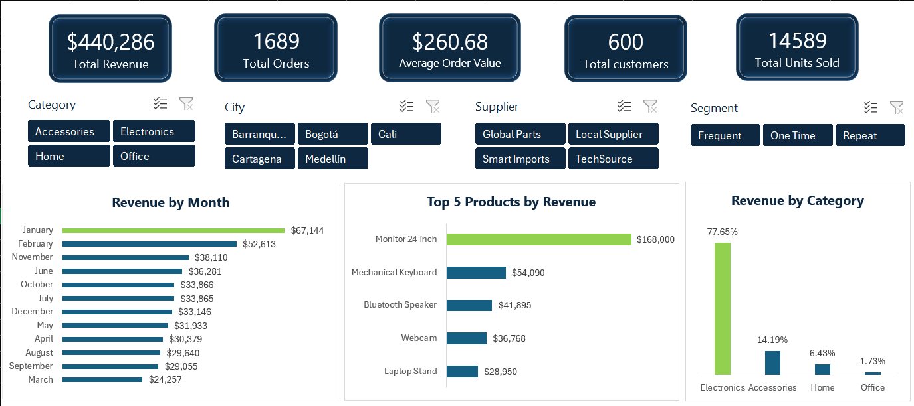
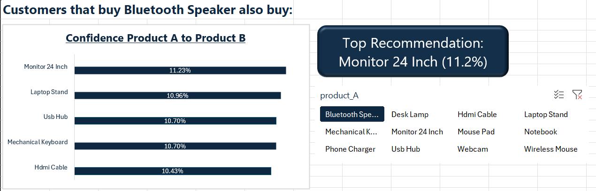
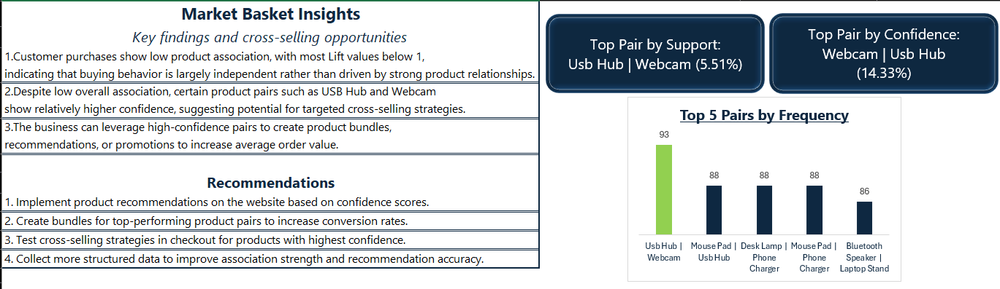

[English](#english) | [Español](#español)

# 🛒 Market Basket Analysis — Caso tipo Amazon (Excel + Power BI Stack)
> Built an Amazon-style recommendation engine in Excel using association rules (Support, Confidence, Lift).

## 🚀 Key Results

- Top product pair: USB Hub & Webcam (5.51% support)
- Highest recommendation confidence: 14.3%
- No strong associations found (Lift < 1 across dataset)
- Built dynamic recommendation engine in Excel


# English
## 📸 Executive Overview Preview

## 📸 Recommender Preview

## 📸 Final Insights Preview


## 📌 Overview

This project simulates an **Amazon-style recommendation system** using only:

* Excel
* Power Query
* Power Pivot

The objective was to perform a **Market Basket Analysis** to identify:

* Cross-selling opportunities
* Product associations
* Customer purchase patterns

---

## 🎯 Business Objective

To answer:

> *Which products are frequently purchased together and how can we use this to improve revenue through recommendations and bundling strategies?*

---

## 🧰 Tech Stack

* Excel
* Power Query (ETL & Data Cleaning)
* Power Pivot (Data Modeling & DAX)
* Pivot Tables & Dashboard Design

---
# 📅 Project Development

---

## 🧠 Methodology

1. Data Cleaning & Validation  
2. Data Modeling (Star Schema)  
3. Market Basket Transformation  
4. Association Metrics Calculation  
5. Recommendation Engine Development  
---


## 🔹 Day 1 — Data Validation & Cleaning

### Key Actions

* Removed null `product_id` rows (41 records)
* Removed invalid `order_date` values (54 records ≈ 1%)
* Standardized text fields
* Converted mixed date formats
* Fixed numeric inconsistencies
* Removed exact duplicates
* Resolved duplicate combinations (`order_id + product_id`)
* Fixed referential integrity (`order_id → customer_id`)

### Data Quality Decisions

* Duplicate records (507) were grouped to preserve revenue accuracy
* Referential integrity was enforced by assigning a single `customer_id` per `order_id`
* Invalid dates were removed instead of imputed to maintain temporal reliability

### Final Dataset

| Metric             | Value |
| ------------------ | ----- |
| Original records   | 5020  |
| Filtered records   | 95    |
| Grouped duplicates | 507   |
| Final records      | 4418  |

---

## 🔹 Day 2 — Data Model & Executive Dashboard

### Data Model

Star schema:

* `fact_sales`
* `dim_products`
* `dim_customers`
* `dim_dates`

✔ One-to-many relationships validated
✔ Date table created dynamically

---

### Measures Created (DAX)

* Total Revenue
* Total Orders
* Total Customers
* Total Units Sold
* Average Order Value

---

### Executive Dashboard

Key visuals:

* Revenue by Month
* Revenue by Category
* Top 5 Products

Filters:

* Category
* City
* Supplier
* Customer Segment

---

## 🔹 Day 3 — Market Basket Structure

### Basket Table Creation

Using Power Query:

* Self join on `order_id`
* Generated product pairs
* Removed duplicate & mirrored pairs

### Final Structure

| order_id | product_A | product_B | Pair_Key |

---

### Result

* 4,938 product combinations generated
* Validated using pivot tables

---

## 🔹 Day 4 — Association Metrics

### Metrics Definition

* **Support** → Frequency of a product pair
* **Confidence** → Probability of B given A
* **Lift** → Strength of association vs randomness

---

### Key Findings

* The pair **USB Hub | Webcam** appears in **5.51% of all orders**
* **14.33% of customers who buy Webcam also buy USB Hub**
* Most Lift values are **below 1**, indicating weak associations

---

### Interpretation

> Customer behavior shows **low dependency between products**, meaning purchases are mostly independent.

---

## 🚀 Product Recommendation Engine (Core Feature)

Built an interactive system:

* Select a product
* Automatically get top recommended products
* Based on **Confidence ranking**

---

### Example

> Customers who bought *Webcam* also bought:

* USB Hub (14.3%)
* Mouse Pad
* Laptop Stand

---

# 📊 Final Dashboard Pages

1. Executive Overview
2. Market Basket Analysis
3. Product Recommendation Engine
4. Business Insights

---

# 🧠 Business Insights

* No strong product bundles emerged naturally
* Some combinations show moderate cross-selling potential
* Recommendation systems should prioritize **confidence over lift**

---

# 🚀 Business Recommendations

* Implement product recommendations based on confidence
* Create bundles for top-performing pairs
* Use checkout cross-selling strategies
* Collect richer data to improve association strength

---
## 💰 Potential Business Impact

- Increase Average Order Value through cross-selling
- Improve product discovery via recommendations
- Enable bundle creation strategies
---

# ⚠️ Limitations

* Dataset is synthetic → lacks strong real-world correlations
* Results may differ significantly with real transactional data

---

# 💡 Key Takeaways

* Built a full analytical pipeline in Excel
* Simulated a real-world recommendation engine
* Translated data insights into business actions

---

# 🏁 Conclusion

This project demonstrates how Excel can be used to:

* Perform advanced analytics
* Build recommendation systems
* Deliver business insights

without requiring advanced tools like Python or Power BI.

--- 

# Repository Structure

```plaintext
Market Basket Analysis/
│── README.md
│── dataset/
│   ├── clean_dataset_market_basket_excel.xlsx
│   ├── original_dataset_market_basket.xlsx
│── images/
│   ├── executive-overview-preview.png
│   ├── recommender-preview.png
│   ├── final-insights-preview.png
```
---

## ▶️ How to Use

1. Open the Excel file  
2. Navigate to "Recommender" sheet  
3. Use the product slicer  
4. Explore recommended products dynamically  
---

## 🧩 Skills Demonstrated

- Data Cleaning & Transformation (Power Query)
- Data Modeling (Star Schema)
- DAX Calculations (Support, Confidence, Lift)
- Business Analysis & Insight Generation
- Dashboard Design in Excel
---


# Español
# 🛒 Análisis de cesta de la compra — Caso tipo Amazon (Excel + Power BI Stack)
> Se creó un motor de recomendaciones al estilo de Amazon en Excel utilizando reglas de asociación (Soporte, Confianza, Lift).

## 🚀 Resultados clave

- Mejor combinación de productos: Hub USB y cámara web (5,51 % de soporte)
- Mayor confianza en la recomendación: 14,3 %
- No se encontraron asociaciones fuertes (Lift < 1 en todo el conjunto de datos)
- Se creó un motor de recomendaciones dinámico en Excel

## 📌 Resumen

Este proyecto simula un **sistema de recomendaciones al estilo Amazon** utilizando únicamente:

* Excel
* Power Query
* Power Pivot

El objetivo era realizar un **Análisis de la cesta de la compra** para identificar:

* Oportunidades de venta cruzada
* Asociaciones de productos
* Patrones de compra de los clientes

---

## 🎯 Objetivo de negocio

Responder a la pregunta:

> *¿Qué productos se compran frecuentemente juntos y cómo podemos usar esta información para aumentar los ingresos mediante recomendaciones y estrategias de paquetes?*

---

## 🧰 Tecnologías utilizadas

* Excel
* Power Query (ETL y limpieza de datos)
* Power Pivot (modelado de datos y DAX)
* Tablas dinámicas y diseño de paneles

---

# 📅 Desarrollo del proyecto

---

## 🔹 Día 1: Validación y limpieza de datos

### Acciones clave

* Se eliminaron las filas con `product_id` nulo (41) registros
* Se eliminaron valores no válidos de `order_date` (54 registros ≈ 1%)
* Se estandarizaron los campos de texto
* Se convirtieron formatos de fecha mixtos
* Se corrigieron inconsistencias numéricas
* Se eliminaron duplicados exactos
* Se resolvieron combinaciones duplicadas (`order_id + product_id`)
* Se corrigió la integridad referencial (`order_id → customer_id`)

### Decisiones sobre la calidad de los datos

* Se agruparon los registros duplicados (507) para preservar la precisión de los ingresos
* Se aplicó la integridad referencial asignando un único `customer_id` por `order_id`
* Se eliminaron las fechas no válidas en lugar de imputarlas para mantener la fiabilidad temporal

### Conjunto de datos final

| Metrica              | Valor |
| ------------------   | ----- |
| Registros originales | 5020  |
| Registros filtrados  | 95    |
| Duplicados agrupados | 507   |
| Registros finales    | 4418  |

---

## 🔹 Día 2 — Modelo de datos y panel ejecutivo

### Modelo de datos

Esquema en estrella:

* `fact_sales`
* `dim_products`
* `dim_customers`
* `dim_dates`

✔ Relaciones uno a muchos validadas
✔ Tabla de fechas creada dinámicamente

---

### Medidas creadas (DAX)

* Ingresos totales
* Pedidos totales
* Clientes totales
* Unidades vendidas totales
* Valor promedio del pedido

---

### Panel ejecutivo

Visualizaciones clave:

* Ingresos por mes
* Ingresos por categoría
* Los 5 productos más vendidos

Filtros:

* Categoría
* Ciudad
* Proveedor
* Segmento de clientes

---

## 🔹 Día 3 — Estructura de la cesta de la compra

### Creación de la tabla de cestas de la compra

Usando Power Query:

* Auto-unión en `order_id`
* Pares de productos generados
* Duplicados eliminados & pares simétricos

### Estructura final

| order_id | product_A | product_B | Pair_Key |

--

### Resultado

* Se generaron 4938 combinaciones de productos
* Validado mediante tablas dinámicas

---

## 🔹 Día 4 — Métricas de asociación

### Definición de métricas

* **Soporte** → Frecuencia de un par de productos
* **Confianza** → Probabilidad de B dado A
* **Elevación** → Fuerza de la asociación frente a la aleatoriedad

---

### Hallazgos clave

* El par **USB hub | La cámara web aparece en el **5,51% de todos los pedidos**.
* El **14,33% de los clientes que compran una cámara web también compran un concentrador USB**.
* La mayoría de los valores de Lift son **inferiores a 1**, lo que indica asociaciones débiles.

---

### Interpretación

> El comportamiento del cliente muestra una **baja dependencia entre productos**, lo que significa que las compras son mayoritariamente independientes.

---

## 🔹 Motor de recomendaciones (estilo Amazon)

Sistema interactivo:

* Seleccionar un producto
* Obtener automáticamente los productos más recomendados
* Basado en el **nivel de confianza**

---

### Ejemplo

> Los clientes que compraron *Webcam* también compraron:

* Hub USB (14,3%)
* Alfombrilla para ratón
* Soporte para portátil

---

# 📊 Páginas del panel de control final

1. Resumen ejecutivo
2. Análisis de la cesta de la compra
3. Motor de recomendaciones de productos
4. Información empresarial

---

# 🧠 Información empresarial

* No surgieron combinaciones de productos sólidas de forma natural
* Algunas combinaciones muestran un potencial de venta cruzada moderado
* Los sistemas de recomendación deben priorizar la **confianza sobre el aumento de ventas**

---

# 🚀 Recomendaciones empresariales

* Implementar recomendaciones de productos basadas en la confianza
* Crear paquetes para las combinaciones con mejor rendimiento
* Utilizar estrategias de venta cruzada en el proceso de compra
* Recopilar datos más completos para mejorar la asociación Fortalezas

---
## 💰 Impacto potencial en el negocio

- Aumentar el valor promedio del pedido mediante la venta cruzada
- Mejorar el descubrimiento de productos a través de recomendaciones
- Facilitar estrategias de creación de paquetes
---

# ⚠️ Limitaciones

* El conjunto de datos es sintético → carece de correlaciones sólidas con datos reales.
* Los resultados pueden diferir significativamente con datos transaccionales reales.

---

# 💡 Conclusiones clave

* Se creó un flujo de trabajo analítico completo en Excel.
* Se simuló un motor de recomendaciones real.
* Se tradujeron los análisis de datos en acciones comerciales.

---

# 🏁 Conclusión

Este proyecto demuestra cómo se puede usar Excel para:

* Realizar análisis avanzados.
* Crear sistemas de recomendación.
* Generar información comercial.

Sin necesidad de herramientas avanzadas como Python o Power BI.

---

# Estructura del repositorio

```plaintext
Market Basket Analysis/
│── README.md
│── dataset/
│   ├── clean_dataset_market_basket_excel.xlsx
│   ├── original_dataset_market_basket.xlsx
│── images/
│   ├── executive-overview-preview.png
│   ├── recommender-preview.png
│   ├── final-insights-preview.png
```

---
## ▶️ Cómo usar

1. Abre el archivo de Excel
2. Ve a la hoja "Recomendadores"
3. Usa el filtro de productos
4. Explora los productos recomendados dinámicamente
---

## 🧩 Habilidades demostradas

- Limpieza y transformación de datos (Power Query)
- Modelado de datos (Esquema de estrella)
- Cálculos DAX (Soporte, Confianza, Lift)
- Análisis de negocio y generación de insights
- Diseño de paneles de control en Excel
---
